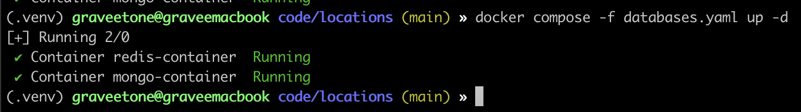
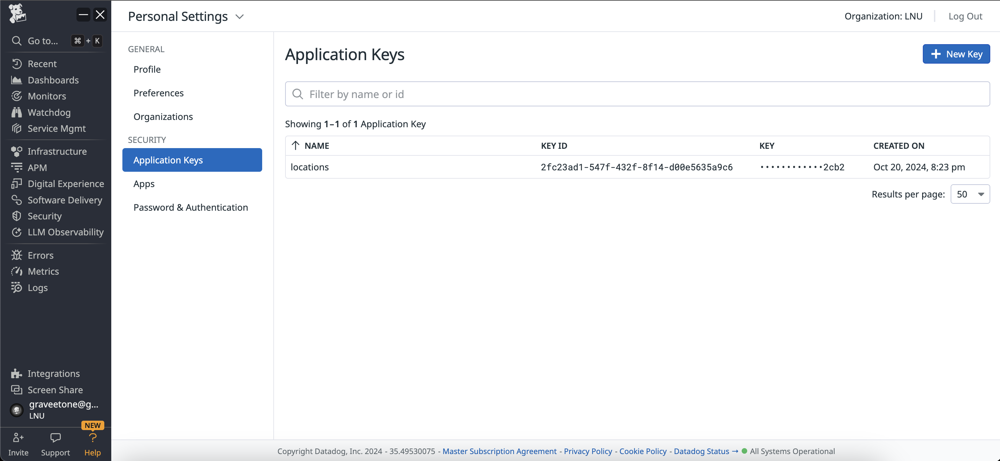
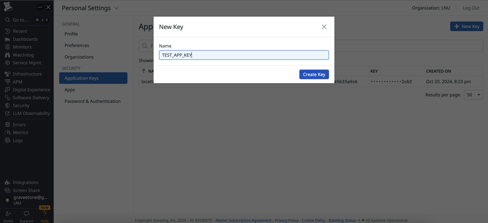
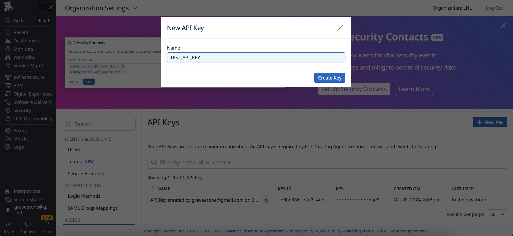
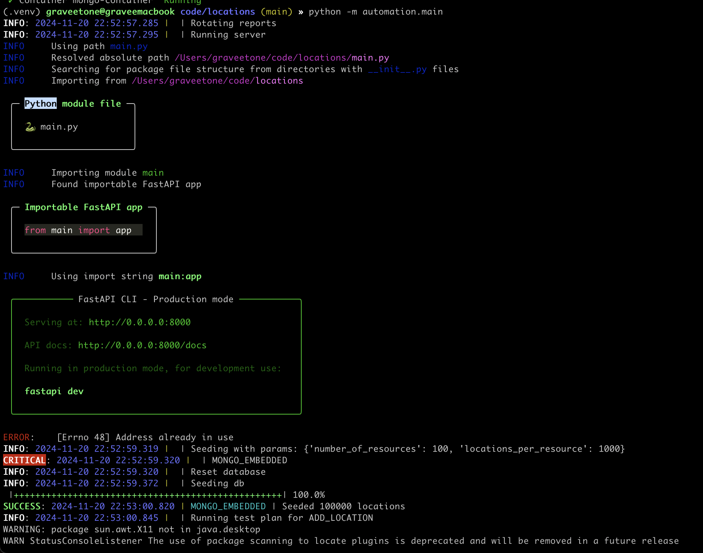
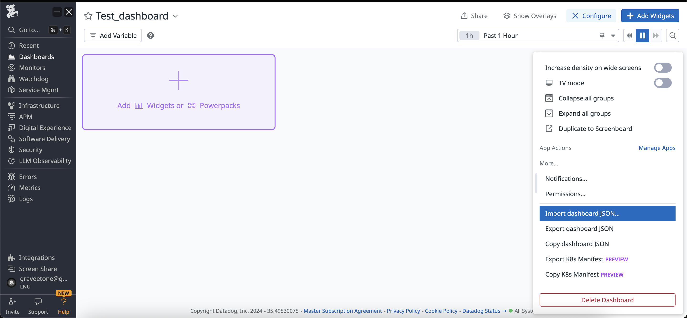
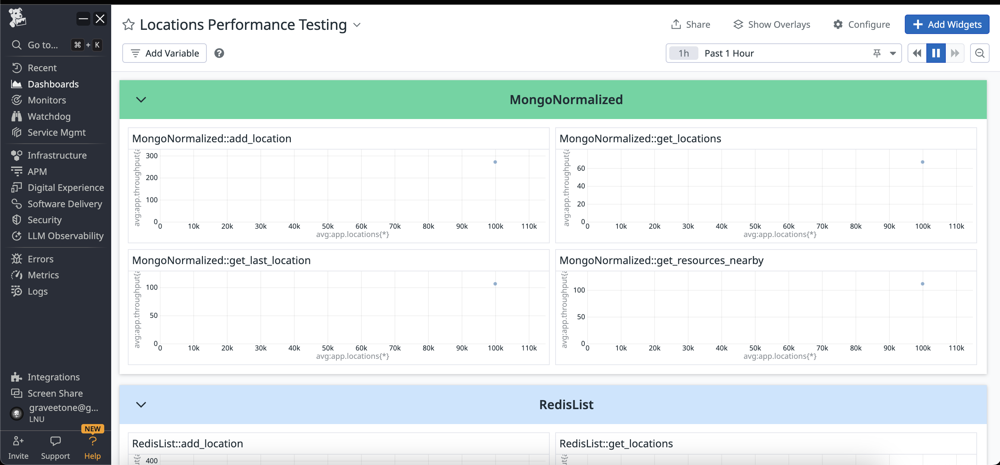

# 🌍 Опис проекту

Проект **locations** складається з двох основних частин:  
1. **Додаток**, в якому імплементовано роботу з геоданими:  
   - ➕ Додавання локацій.  
   - 🧭 Отримання останньої або всіх локацій.  
   - 🔍 Пошук ресурсів поблизу.  
2. **Автоматизація навантажувального тестування**, що включає:  
   - 🚀 Запуск тест-плану, який виконує визначену кількість запитів протягом певного періоду часу.  
   - 📊 Збереження отриманих результатів.

---

## 🛠 Використані технології

1. 🐍 **Python** — основна мова програмування.  
2. ⚡ **FastAPI** — асинхронний веб-фреймворк для створення додатка.  
3. 🗄 **MongoDB** — документоорієнтована NoSQL база даних, що використана для тестування.  
4. 🗂 **Redis** — NoSQL база типу "ключ-значення", що використана для тестування.  
5. 📈 **Apache JMeter** — інструмент для виконання навантажувального тестування (використовує компілятор мови Java).  
6. 🐕 **Datadog** — платформа для збереження результатів тестування у вигляді метрик.  

## 📦 Розгортання проекту

### 🗂 Встановлення баз даних

Для роботи проекту необхідно встановити локальні сервери баз **MongoDB** та **Redis**.  
Скористайтеся відповідними інструкціями для вашої операційної системи:  
- [Інструкція для MongoDB](https://www.mongodb.com/docs/manual/installation/)  
- [Інструкція для Redis](https://redis.io/docs/latest/operate/oss_and_stack/install/install-redis/)  

### 🐳 Альтернатива: Docker

Альтернативою є використання **Docker** для запуску баз даних всередині ізольованого середовища у вигляді контейнерів.  
1. Встановіть Docker, дотримуючись [інструкції](https://docs.docker.com/engine/install/).  
2. Виконайте команду для запуску серверів баз даних у контейнерах:  
   ```bash
   docker compose -f databases.yaml up -d
    ```
   Файл databases.yaml є конфігураційним файлом для запуску Docker контейнерів і знаходиться в цьому репозиторії.



### ☕ Встановлення Java та Apache JMeter

Для використання **Apache JMeter** необхідно:  
1. Встановити компілятор мови Java за [інструкцією](https://www.java.com/en/download/manual.jsp).  
2. Встановити Apache JMeter, дотримуючись [інструкції](https://jmeter.apache.org/download_jmeter.cgi).  

---

### 🐕‍🦺 Налаштування Datadog

1. Зареєструйте акаунт на платформі [Datadog](https://app.datadoghq.eu/).  
2. Згенеруйте токени **API_KEY** та **APP_KEY**. Приклади наведено на знімках екрану:








---

### 📄 Створення файлу `.env`

Додаток та автоматизація використовують конфіденційну інформацію, яка не може бути збережена в репозиторії через її чутливість або змінюваність для кожного користувача.  

1. Шаблон файлу `.env` знаходиться в репозиторії `(.env.template)`
2. У файлі `.env` необхідно вказати:  
   - Адреси хостів та порти для **MongoDB** і **Redis**.  
   - Шлях до встановленого виконуваного файлу **JMeter**.  
   - Згенеровані токени для **Datadog**.  
3. Цей файл автоматично підвантажується в конфігурації додатка.  

### 🚀 Запуск додатка

На цьому етапі повинні бути виконані наступні умови:  
1. Запущені сервери баз даних.  
2. Встановлений Apache JMeter.  
3. Налаштований акаунт на платформі **Datadog**.  
4. Заповнений файл `.env`.

Для запуску автоматизації:  
1. Встановіть залежності проекту командою:
   ```bash
   python3 -m pip install -r requirements.txt
   ```
   всередині папки проекту.
2. Запустіть скрипт автоматизації командою:
      ```bash
   python3 -m automation.main
   ```
Приклад результату відображений на знімку екрану:



Після виконання скрипта, результати тестування з'являться у вигляді метрик в системі Datadog.
Для відображення результатів створіть нову панель та налаштуйте її.
Для швидкої конфігурації панелі імпортуйте файл datadog_dashboard.json, який знаходиться в репозиторії.
Приклади налаштування панелі наведені на знімках екрану:




